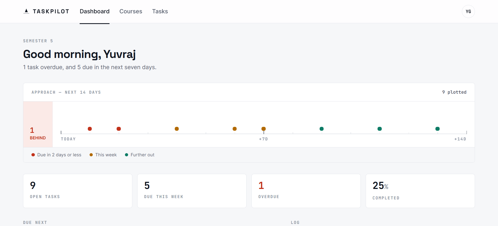
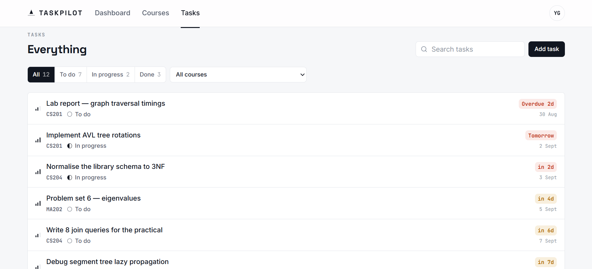
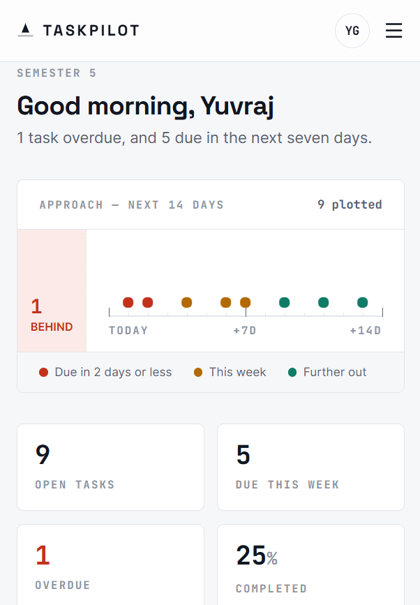

# TaskPilot

**Coursework, on approach.** TaskPilot is an AI-assisted coursework and
assignment planner for students. You add your courses, TaskPilot tracks every
assignment against its deadline, and the AI planner turns a raw assignment brief
into a scheduled set of subtasks.

Built as the connected four-task project for the **Innovation Hacks Full Stack
Development Internship**.

---

## Task submissions

| Task | Scope | Release | Demo video | LinkedIn |
| ---- | ----- | ------- | ---------- | -------- |
| 1 — Modern Frontend | React dashboard, responsive, mock data | [`task-1`](../../releases/tag/task-1) | [`Watch Demo`](https://drive.google.com/file/d/1sTDb_GyMZmjCKK99tLfIPM1-ssDgszKH/view?usp=sharing) | [`Post`]([https://lnkd.in/p/dY2FPymM](https://lnkd.in/p/dY2FPymM)) |
| 2 — Backend & REST API | Express API for users, courses, tasks | _pending_ | _pending_ | _pending_ |
| 3 — Database Integration | PostgreSQL + Prisma persistence | _pending_ | _pending_ | _pending_ |
| 4 — Final Full-Stack App | Auth, integration, AI planner, deployed | _pending_ | _pending_ | _pending_ |

---

## The idea

Students don't have an organisation problem, they have a **time-pressure**
problem. So TaskPilot is built around deadlines rather than lists, and the
interface follows one strict rule:

> **Colour is reserved for time pressure.**

Buttons, progress bars, status badges and structure are all monochrome ink. The
only coloured things on screen are the deadlines that are actually running out —
which means urgency is impossible to miss and impossible to confuse with
decoration.

The signature view is the **Approach strip**: a 14-day glide path with every
unfinished assignment plotted on the day it's due. Three markers stacked on one
day is deadline clustering — the thing a list view will never show you.

---

## Features

### Task 1 — Frontend (complete)

- **Dashboard** — greeting, semester summary, Approach strip, four instrument
  readouts (open / due this week / overdue / completed)
- **Approach strip** — 14-day deadline timeline with an overdue cluster
- **Courses** — card grid with per-course progress and overdue counts
- **Tasks** — sortable list with search, status filter, and per-course filter
  driven by the URL query string
- **Profile** — user section with a semester summary
- **Search and filter** across both courses and tasks
- **Loading, empty, and error states** on every dynamic view — including
  distinct copy for "nothing here yet" versus "nothing matched your filter"
- **Responsive** from 375 px to desktop, with a collapsing nav drawer
- **Accessibility** — skip link, `aria-current` nav state, labelled controls,
  visible keyboard focus, `prefers-reduced-motion` respected

### Planned

- Task 2 — REST API for users, courses and tasks with validation and centralised
  error handling
- Task 3 — PostgreSQL persistence via Prisma, with modelled relationships
- Task 4 — JWT auth and protected routes, plus the **AI Assignment Planner**:
  paste an assignment brief, get subtasks with suggested milestone dates and
  priorities, and add them all in one click

---

## Tech stack

| Layer    | Technology                                  |
| -------- | ------------------------------------------- |
| Frontend | React 19, Vite 8, Tailwind CSS 4, React Router 7 |
| Icons    | Lucide                                      |
| Backend  | Node.js + Express _(Task 2)_                |
| Database | PostgreSQL + Prisma _(Task 3)_              |
| AI       | Claude API _(Task 4)_                       |

Type: `Space Grotesk` for display, `Inter` for body, `JetBrains Mono` for every
numeric reading.

---

## Getting started

**Requirements:** Node.js 20 or newer, npm.

```bash
git clone https://github.com/yuvrajgaud/TaskPilot.git
cd TaskPilot/client
npm install
npm run dev
```

The app runs at `http://localhost:5173`.

### Environment variables

Copy `.env.example` to `.env` and fill in your own values:

```bash
cp .env.example .env
```

Task 1 runs entirely on mock data and needs no environment variables. The file
documents what each later task will require. **Never commit `.env`** — it is
gitignored, and `.env.example` holds placeholders only.

### Seeing the loading, empty, and error states

Task 1 runs on a mock API client with simulated latency, so all three states are
real code paths rather than mockups. Force any of them with a query parameter:

| URL                       | Shows                       |
| ------------------------- | --------------------------- |
| `/?state=loading`         | Skeleton loaders            |
| `/?state=empty`           | Empty states                |
| `/?state=error`           | Error states with retry     |

---

## Project structure

```
TaskPilot/
├── client/                     # React frontend (Task 1)
│   └── src/
│       ├── components/
│       │   ├── layout/         # Navbar, Layout
│       │   ├── ui/             # Panel, Button, Badges, ProgressBar, States, Controls
│       │   ├── dashboard/      # ApproachStrip, StatReadout
│       │   ├── courses/        # CourseCard
│       │   └── tasks/          # TaskRow
│       ├── pages/              # Dashboard, Courses, Tasks, Profile, NotFound
│       ├── hooks/              # useAsync — loading/error/retry lifecycle
│       ├── lib/                # dates (urgency), selectors, api client, cn
│       └── data/               # mock data, shaped like the Task 2 API response
├── server/                     # Express API (Task 2)
├── docs/
│   ├── screenshots/
│   └── api/                    # Postman collection / OpenAPI spec (Task 2)
├── .env.example
└── README.md
```

**Design note:** `client/src/lib/api.js` is the only file that knows where data
comes from. Every component consumes it through the same promise-based
interface, so swapping mock data for the real Task 2 API is a one-file change.

---

## Screenshots

_Added at the end of each task._

| Dashboard | Tasks | Mobile |
| --------- | ----- | ------ |
|  |  |  |

---

## Author

**Yuvraj Gaud** — Full Stack Development Intern, Innovation Hacks
