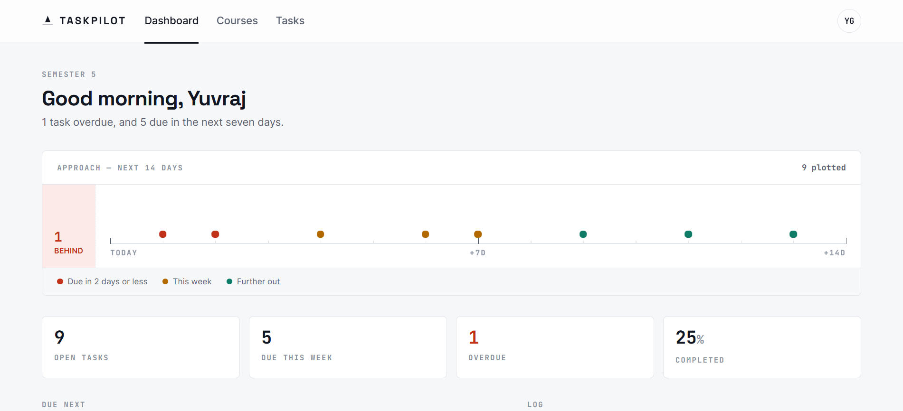
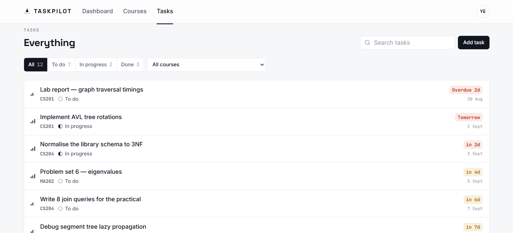
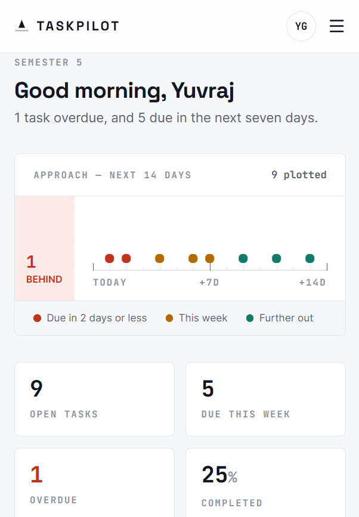

# TaskPilot

**Coursework, on approach.** TaskPilot is an AI-assisted coursework and
assignment planner for students. You add your courses, TaskPilot tracks every
assignment against its deadline, and the AI planner turns a raw assignment brief
into a scheduled set of subtasks.

Built as the connected four-task project for the **Innovation Hacks Full Stack
Development Internship**.

---

## Task submissions

| Task | Scope | Release | Demo video | LinkedIn |
| ---- | ----- | ------- | ---------- | -------- |
| 1 — Modern Frontend | React dashboard, responsive, mock data | [`task-1`](https://github.com/yuvrajgaud/TaskPilot/releases/tag/task-1) | [`Watch Demo`](https://drive.google.com/file/d/1sTDb_GyMZmjCKK99tLfIPM1-ssDgszKH/view?usp=sharing) | [`Post`](https://lnkd.in/p/dY2FPymM) |
| 2 — Backend & REST API | Express API for users, courses, tasks | [`task-2`](https://github.com/yuvrajgaud/TaskPilot/releases/tag/task-2) | [`Watch Demo`](https://drive.google.com/file/d/1yV3P_roeZPKjbtFU-1SQEh7L3qzU2LP9/view?usp=drive_link) | [`Post`](https://lnkd.in/p/d-4Ez92u) |
| 3 — Database Integration | PostgreSQL + Prisma persistence | [`task-3`](https://github.com/yuvrajgaud/TaskPilot/releases/tag/task-3) | [`Watch Demo`](https://drive.google.com/file/d/1jKqG1TthyloWTCRFvvxNFHrTtTVR9KRr/view?usp=sharing) | [`Post`](https://lnkd.in/p/gSwKbjsB) |
| 4 — Final Full-Stack App | JWT auth, live API, AI planner, deployed | [`task-4`](https://github.com/yuvrajgaud/TaskPilot/releases/tag/task-4) | [`Watch Demo`](https://drive.google.com/) | [`Post`](https://www.linkedin.com/) |

**Live app:** https://aitaskpilot.netlify.app · **API:** https://taskpilot-api-911z.onrender.com/api/health

---

## The idea

Students don't have an organisation problem, they have a **time-pressure**
problem. So TaskPilot is built around deadlines rather than lists, and the
interface follows one strict rule:

> **Colour is reserved for time pressure.**

Buttons, progress bars, status badges and structure are all monochrome ink. The
only coloured things on screen are the deadlines that are actually running out —
which means urgency is impossible to miss and impossible to confuse with
decoration.

The signature view is the **Approach strip**: a 14-day glide path with every
unfinished assignment plotted on the day it's due. Three markers stacked on one
day is deadline clustering — the thing a list view will never show you.

---

## Features

### Task 1 — Frontend (complete)

- **Dashboard** — greeting, semester summary, Approach strip, four instrument
  readouts (open / due this week / overdue / completed)
- **Approach strip** — 14-day deadline timeline with an overdue cluster
- **Courses** — card grid with per-course progress and overdue counts
- **Tasks** — sortable list with search, status filter, and per-course filter
  driven by the URL query string
- **Assignment detail** — a single-assignment view with its full brief, a
  coloured time-left reading, and the other assignments in the same course
- **Profile** — user section with a semester summary
- **Search and filter** across both courses and tasks
- **Loading, empty, and error states** on every dynamic view — including
  distinct copy for "nothing here yet" versus "nothing matched your filter"
- **Responsive** from 375 px to desktop, with a collapsing nav drawer
- **Accessibility** — skip link, `aria-current` nav state, labelled controls,
  visible keyboard focus, `prefers-reduced-motion` respected

### Task 2 — Backend API (complete)

- **REST API** in `server/` — Express, with `courses` and `tasks` full CRUD,
  plus `users/me` and `activity`
- **Filtering** — `GET /tasks?course=&status=&q=` mirrors the Tasks page
- **Validation** — every write body is checked with zod; a bad body returns
  `400` with per-field details, and an unknown `courseId` is a `400`, not an orphan
- **Consistent envelope** — `{ data }` on success, `{ error: { message, code,
  details? } }` on failure, with correct status codes throughout
- **Docs** — endpoint reference and a Postman collection in
  [`docs/api/`](docs/api/README.md)

### Task 3 — Database (complete)

- **PostgreSQL + Prisma** — the in-memory store is now a real database; data
  survives restarts
- **Modelled relationships** — `User → Course → Task`, plus `Activity`, with
  cascading deletes enforced by the database
- **Migrations** committed under `server/prisma/migrations/`, and a **seed
  script** for sample data
- **Same API** — routes and response shapes are unchanged from Task 2; only the
  store's internals changed
- **Secure config** — the connection string is read from the environment, never
  hard-coded; schema and diagram in [`docs/db/`](docs/db/README.md)

### Task 4 — Auth, integration & AI planner (complete)

- **Accounts & JWT auth** — register and sign in; passwords hashed with
  bcrypt, sessions carried as a stateless JWT. Protected routes reject
  requests without a valid token (`401`).
- **Per-user data** — every course, task and activity is scoped to the
  signed-in student; one account can never read or mutate another's data.
- **Frontend wired to the real API** — the Task 1 mock store is gone; every
  view now reads and writes through the live REST API.
- **AI Assignment Planner** — asks Google Gemini to turn your unfinished
  assignments into a day-by-day study plan, using structured JSON output so
  the response is always the shape the UI expects.
- **Production-hardened API** — Helmet security headers, a CORS allowlist,
  and tiered rate limiting (strict on auth, quota-guarded on the planner).
- **Deployed** — server on Render, database on Neon, client on Netlify.

---

## Tech stack

| Layer    | Technology                                  |
| -------- | ------------------------------------------- |
| Frontend | React 19, Vite 8, Tailwind CSS 4, React Router 7 |
| Icons    | Lucide                                      |
| Backend  | Node.js + Express, zod validation           |
| Database | PostgreSQL + Prisma                         |
| AI       | Google Gemini API _(Task 4)_                |

Type: `Space Grotesk` for display, `Inter` for body, `JetBrains Mono` for every
numeric reading.

---

## Getting started

**Requirements:** Node.js 20 or newer, npm.

```bash
git clone https://github.com/yuvrajgaud/TaskPilot.git
cd TaskPilot/client
npm install
npm run dev
```

The app runs at `http://localhost:5173`.

### Run the API

The REST API is a separate service in `server/`. It needs a PostgreSQL
database — any local or hosted Postgres (e.g. Neon) — and a Google Gemini API
key for the AI planner:

```bash
cd TaskPilot/server
npm install
cp .env.example .env         # set DATABASE_URL, DIRECT_URL, JWT_SECRET, GEMINI_API_KEY, CLIENT_URL
npm run prisma:migrate        # create the tables
npm run db:seed               # load sample data
npm run dev
```

It listens on `http://localhost:4000/api`. The client talks to it through
`VITE_API_URL` (see `client/.env.example`) — set it to `http://localhost:4000/api`
for local development. See [`docs/api/`](docs/api/README.md) for the endpoint
reference and Postman collection, and [`docs/db/`](docs/db/README.md) for the
database schema and diagram.

### Environment variables

Copy each `.env.example` to `.env` and fill in your own values:

```bash
cp server/.env.example server/.env
cp client/.env.example client/.env
```

The **server** needs `DATABASE_URL` + `DIRECT_URL` (Postgres), `JWT_SECRET`
(a long random string), `GEMINI_API_KEY` and `CLIENT_URL` (the client origin,
for CORS). The **client** needs `VITE_API_URL` (the API base URL). **Never
commit `.env`** — it is gitignored, and `.env.example` holds placeholders only.

### Deploy

Deployed as three services, all free-tier: the database on **Neon**, the API on
**Render** (`render.yaml`), and the client on **Netlify** (`netlify.toml`). Set
the server's env vars in the Render dashboard and the client's `VITE_API_URL` in
Netlify's — secrets never live in the repo.

### Seeing the loading, empty, and error states

Every dynamic view on the mock client had loading, empty and error states, kept
in the live client too. Force any of them with a query parameter:

| URL                       | Shows                       |
| ------------------------- | --------------------------- |
| `/?state=loading`         | Skeleton loaders            |
| `/?state=empty`           | Empty states                |
| `/?state=error`           | Error states with retry     |

---

## Project structure

```
TaskPilot/
├── client/                     # React frontend
│   └── src/
│       ├── components/
│       │   ├── layout/         # Navbar, Layout, AuthShell
│       │   ├── ui/             # Panel, Button, Badges, Form, Modal, States
│       │   ├── dashboard/      # ApproachStrip, StatReadout
│       │   ├── courses/        # CourseCard, CourseFormModal
│       │   ├── tasks/          # TaskRow, TaskFormModal
│       │   ├── profile/        # ProfileFormModal
│       │   └── planner/        # PlanView
│       ├── auth/               # AuthProvider, RequireAuth, token context
│       ├── pages/              # Dashboard, Courses, Tasks, TaskDetail, Planner, Profile, Login, Register
│       ├── hooks/              # useAsync — loading/error/retry lifecycle
│       └── lib/                # api client, dates (urgency), form errors, cn
├── server/                     # Express REST API + PostgreSQL + JWT auth + AI planner
│   ├── prisma/                 # schema, migrations, seed
│   └── src/
│       ├── routes/             # one router per resource, mounted under /api
│       ├── controllers/        # request → store → response
│       ├── schemas/            # zod validation per resource
│       ├── middleware/         # validate, auth, rate limiting, notFound, errorHandler
│       ├── lib/                # prisma client, gemini client, planner, ApiError, helpers
│       └── data/               # store (Prisma over PostgreSQL)
├── docs/
│   ├── screenshots/
│   ├── api/                    # endpoint reference + Postman collection
│   └── db/                     # database schema + ER diagram
├── render.yaml                 # Render blueprint (API)
├── netlify.toml                # Netlify config (client)
└── README.md
```

**Design note:** `client/src/lib/api.js` is the only file that knows where data
comes from. Every component consumes it through the same promise-based
interface — so wiring the Task 1 mock store to the real Task 2 API in Task 4 was
a one-file change; no component had to move.

---

## Screenshots

_Added at the end of each task._

| Dashboard | Tasks | Mobile |
| --------- | ----- | ------ |
|  |  |  |

---

## Author

**Yuvraj Gaud** — Full Stack Development Intern, Innovation Hacks
