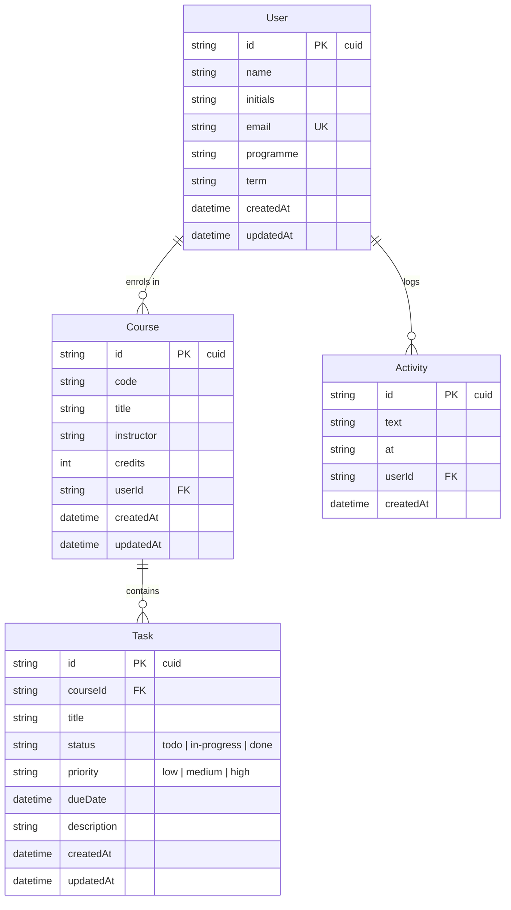

# TaskPilot Database

**Task 3** gives TaskPilot real persistence. The API from Task 2 is unchanged —
same routes, same request and response shapes — but the in-memory store behind
it is now **PostgreSQL**, accessed through **Prisma**. Restart the server and the
data is still there.

- **Engine:** PostgreSQL
- **ORM / migrations:** Prisma 6
- **Schema:** [`server/prisma/schema.prisma`](../../server/prisma/schema.prisma)
- **Seed:** [`server/prisma/seed.js`](../../server/prisma/seed.js)
- **Config:** connection string from `DATABASE_URL` (env only — never hard-coded)

## Schema diagram



> GitHub renders this Mermaid block as a diagram automatically — no image file to
> keep in sync with the schema.

## Relationships

The shape mirrors how the app is used: a **student** takes several **courses**,
and each course has many **assignments**.

| Relationship | Cardinality | On delete |
| ------------ | ----------- | --------- |
| User → Course | one-to-many | **Cascade** — deleting a user removes their courses |
| Course → Task | one-to-many | **Cascade** — deleting a course removes its tasks |
| User → Activity | one-to-many | **Cascade** — deleting a user removes their activity |

Cascades are declared in the schema (`onDelete: Cascade`), so the database — not
application code — guarantees there are never orphaned tasks or activity rows.
Every foreign key (`userId`, `courseId`) is indexed for fast lookups and joins.

## Design decisions

A few choices are deliberate and worth explaining, since the point of the task is
to *understand* the implementation, not just run it:

- **`id` is a `cuid`.** New records created through the API get a collision-safe
  `cuid()` primary key. The **seed** sets explicit friendly ids (`u_1`, `c_1`,
  `t_1`, …) instead, so the API docs, the Postman collection, and demo `curl`
  commands keep working against predictable ids.
- **`status` and `priority` are `String`, not a Postgres `enum`.** The allowed
  set includes `in-progress`, whose hyphen a Postgres enum label can't hold
  cleanly. The values are still constrained — **zod** validates them at the API
  edge (`todo | in-progress | done`, `low | medium | high`) before anything
  reaches the database. The default is set in the schema (`@default("todo")`).
- **`dueDate` is a real `DateTime`.** The API accepts and returns ISO 8601
  strings; the store converts on the way in (`new Date(...)`) and `res.json`
  serialises back to ISO on the way out, so the wire format is identical to
  Task 2.
- **`createdAt` / `updatedAt` on every table.** Managed by Prisma
  (`@default(now())` / `@updatedAt`). These are new fields the persistence layer
  adds; they appear in responses but nothing is required to send them.
- **`Activity.at` stays a display string** (`"2h ago"`, `"Yesterday"`). It's a
  human label from Task 1's UI; the sortable truth is `createdAt`, which the feed
  orders by.

## Data-access boundary

All database access lives in one module —
[`server/src/data/store.js`](../../server/src/data/store.js). Controllers call
`store.*` and never touch Prisma directly, exactly as in Task 2. That's why the
swap from arrays to PostgreSQL didn't change a single route: only the store's
internals changed (and its functions became `async`).

Prisma throws `P2025` when an update or delete targets a row that doesn't exist.
The store catches that and returns `null` / `false`, so the controllers' existing
"not found → 404" logic works untouched.

## Configuration & secrets

The connection string is a **secret** and is read only from the environment:

```prisma
datasource db {
  provider = "postgresql"
  url      = env("DATABASE_URL")
}
```

- `DATABASE_URL` lives in `server/.env` (git-ignored) locally, and in the deploy
  host's environment variables in production.
- [`server/.env.example`](../../server/.env.example) documents the variable with
  a **placeholder** value — never a real credential.
- The server fails fast on startup with a clear message if `DATABASE_URL` is
  missing, rather than erroring deep inside the first request.

A hosted Postgres (Neon, Supabase, RDS, …) and a local install use the **same
code** — only `DATABASE_URL` differs.

## Working with the database

Run these from `server/` (needs a valid `DATABASE_URL` in `server/.env`):

```bash
npm run prisma:generate   # regenerate the client after editing the schema
npm run prisma:migrate     # create/apply a migration (prisma migrate dev)
npm run db:seed            # load the sample student, courses, tasks, activity
npm run prisma:studio      # browse the data in Prisma Studio
```

First-time setup:

```bash
cd server
cp .env.example .env        # then edit .env: set DATABASE_URL to your database
npm install
npm run prisma:migrate -- --name init
npm run db:seed
npm run dev
```

Migrations are committed under `server/prisma/migrations/`, so the exact schema
history is reproducible on any machine.
